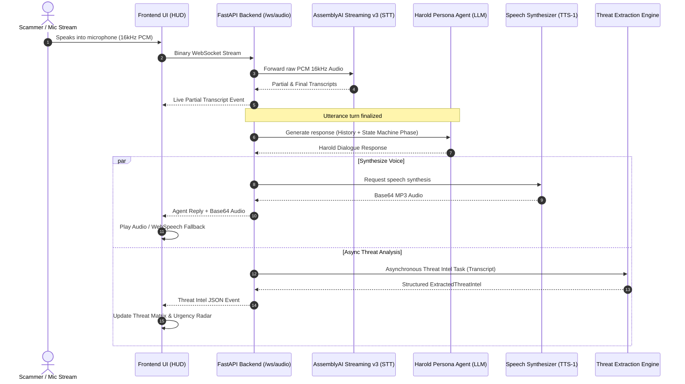

# 🛡️ ScamTrap AI — Autonomous Voice Honeypot & Threat Intel Matrix

[](https://fastapi.tiangolo.com)
[](https://www.assemblyai.com)
[](https://openai.com)
[](https://www.python.org/)
[](LICENSE)

> **An autonomous, low-latency conversational voice honeypot that intercepts scam calls, wastes fraudsters' time with adaptive AI personas, and extracts forensic threat intelligence in real time.**

---

## 📌 Table of Contents

- [Overview](#-overview)
- [Key Features](#-key-features)
- [System Architecture](#-system-architecture)
- [Honeypot Strategy & Persona](#-honeypot-strategy--persona)
- [Threat Intelligence Forensics](#-threat-intelligence-forensics)
- [Project Structure](#-project-structure)
- [Prerequisites & Environment](#-prerequisites--environment)
- [Installation & Quick Start](#-installation--quick-start)
- [Usage & Testing Guide](#-usage--testing-guide)
- [REST & WebSocket API Specs](#-rest--websocket-api-specs)
- [Future Scope & Roadmap](#-future-scope--roadmap)
- [Contributing](#-contributing)
- [License & Disclaimer](#-license--disclaimer)

---

## 🔍 Overview

Phone scams and social engineering attacks cost individuals and businesses billions annually. Traditional call blockers simply disconnect or drop calls, allowing scammers to quickly move to the next target without penalty or exposure.

**ScamTrap AI** flips the script by deploying an intelligent conversational honeypot named **"Harold Vance"** (a 78-year-old retired accountant). Harold sounds authentic, acts slightly hard of hearing, feigns confusion, and deliberately stalls fraudsters. While the scammer is busy spelling out websites and repeating fake bank account numbers, an asynchronous threat extraction engine parses the live stream to harvest actionable **Indicators of Compromise (IoCs)**:
- 💳 Mule Bank Accounts & Routing Numbers
- 💰 Wire / Cashier Check Targets & Extorted Amounts
- 🌐 Malicious URLs & Remote Access Tools (AnyDesk, TeamViewer, UltraViewer)
- 🚨 Impersonated Agencies (IRS, FTC, Law Enforcement, Microsoft, Amazon)
- 🎯 Social Engineering Tactics (Arrest threats, urgency, malware scares)

---

## ✨ Key Features

| Category | Feature | Description |
| :--- | :--- | :--- |
| 🎙️ **Streaming STT** | **AssemblyAI Streaming v3** | Low-latency, real-time 16kHz PCM audio transcription over WebSockets with live partial interim transcripts and turn detection. |
| 👴 **Adaptive Persona** | **"Harold Vance" Honeypot** | Ultra-realistic 78-year-old persona engineered to maximize call duration without arousing suspicion. |
| ⚙️ **State Engine** | **Finite State Machine** | Dynamic conversational phases (`hooking` ➔ `feigning_confusion` ➔ `stalling` ➔ `extracting` ➔ `wrap_up`) powered by `transitions`. |
| 🗣️ **Dual Speech Synthesis** | **OpenAI TTS & WebSpeech Fallback** | Natural voice delivery using OpenAI TTS-1 (`onyx`) with automatic client-side browser speech synthesis fallback. |
| 🧠 **Threat Intelligence** | **Async Forensic Extraction** | Non-blocking OpenAI Structured Output parsing (`gpt-4o-mini`) + regex heuristic engine to extract actionable IoCs. |
| 🖥️ **Cyber HUD Dashboard** | **Real-Time Telephony Console** | Tactical dark-mode interface with audio visualizer, call telemetry, live feed, phase badges, urgency radar, and 1-click JSON report export. |
| ⚡ **Offline Resilience** | **Zero-Quota Fallback Engine** | Heuristic offline dialogue system and regex threat extractor that keeps the honeypot operating even during API quota limits. |
| 🧪 **Simulation Chips** | **1-Click Test Scenarios** | Built-in scenario presets for FTC arrest threats, tech-support malware scams, and bank wire fraud. |

---

## 🏗️ System Architecture

The following diagram illustrates the end-to-end data flow between the caller/mic, the FastAPI backend, AssemblyAI STT, OpenAI LLM/TTS, and the live Forensics Matrix:



---

## 🎭 Honeypot Strategy & Persona

Harold Vance uses calibrated psychological techniques to maximize call duration and harvest high-fidelity evidence:

```
[ Phase 1: Hooking ] ───────► "Hello? Yes, Harold speaking... Who is this calling?"
          │
          ▼
[ Phase 2: Confusion ] ─────► "Oh goodness, let me adjust my hearing aid... Can you explain that again?"
          │
          ▼
[ Phase 3: Stalling ] ──────► "Hold on, I'm looking for my reading glasses and checkbook on the counter..."
          │
          ▼
[ Phase 4: Extracting ] ────► "Okay, I have my yellow notepad. Could you spell that website address letter by letter?"
          │
          ▼
[ Phase 5: Wrap Up ] ───────► "Let me read that back to you to make sure I have every single digit right..."
```

### Psychological Stall Tactics Employed:
- **Hearing Aid / Glasses Excuses**: Forces scammers to repeat sentences slowly.
- **Intentional Misspelling**: Prompts scammers to repeat phishing URLs and domains character-by-character.
- **Account Number Verification**: Feigns writing down account/routing numbers on paper, capturing mule account details.
- **Polite Compliance**: Prevents aggressive scammer hang-ups by expressing a desire to "resolve the issue".

---

## 🛡️ Threat Intelligence Forensics

ScamTrap AI extracts structured indicators using Pydantic models:

```json
{
  "caller_claimed_identity": "Federal Trade Commission (FTC)",
  "tactics_used": [
    "Arrest / Legal Threat",
    "Urgency / Artificial Panic",
    "Financial Extortion / Mule Transfer"
  ],
  "mule_bank_accounts": [
    "Account #8839201948",
    "Demanded Amount: $4,500"
  ],
  "phone_numbers_mentioned": [
    "800-555-0199"
  ],
  "urls_or_domains": [
    "www.help-desk99.com",
    "AnyDesk (Remote Access Tool)"
  ],
  "urgency_level": "Critical"
}
```

The matrix updates in real time on the dashboard and can be exported as a forensic JSON report with one click for submission to law enforcement or incident response feeds.

---

## 📁 Project Structure

```text
assemblyai_scam_trap/
│
├── backend/
│   ├── __init__.py
│   ├── main.py              # FastAPI server, WebSockets & streaming audio pipeline
│   ├── agent.py             # Harold persona LLM prompt, fallback generator & TTS synthesis
│   ├── intel_extractor.py   # Asynchronous structured threat intel extraction & heuristics
│   └── models.py            # Pydantic schemas (ExtractedThreatIntel) & State Machine
│
├── frontend/
│   ├── index.html           # Tactical Cyber HUD layout and audio console
│   ├── style.css            # Dark mode glassmorphism UI & telemetry animations
│   └── app.js               # Audio capture (16kHz PCM), WebSockets, visualizer & UI state
│
├── .env                     # API keys configuration (AssemblyAI & OpenAI)
├── requirements.txt         # Python package dependencies
└── README.md                # Comprehensive documentation
```

---

## ⚙️ Prerequisites & Environment

### System Requirements
- **Python**: 3.10, 3.11, or 3.12
- **Operating System**: Windows, macOS, or Linux
- **Modern Browser**: Chrome, Edge, Firefox, or Safari (Microphone permissions required for voice mode)

### API Keys
1. **AssemblyAI API Key**: Obtain from [AssemblyAI Dashboard](https://www.assemblyai.com/). (Used for Streaming Speech-to-Text).
2. **OpenAI API Key**: Obtain from [OpenAI Platform](https://platform.openai.com/). (Used for `gpt-4o-mini` conversational responses, TTS voice generation, and structured intel extraction).

---

## 🚀 Installation & Quick Start

### 1. Clone the Repository
```bash
git clone https://github.com/your-username/assemblyai_scam_trap.git
cd assemblyai_scam_trap
```

### 2. Create and Activate Virtual Environment

**On Windows (PowerShell):**
```powershell
python -m venv venv
.\venv\Scripts\Activate.ps1
```

**On macOS / Linux:**
```bash
python3 -m venv venv
source venv/bin/activate
```

### 3. Install Dependencies
```bash
pip install -r requirements.txt
```

### 4. Configure Environment Variables
Create or edit the `.env` file in the project root:

```env
ASSEMBLYAI_API_KEY=your_assemblyai_api_key_here
OPENAI_API_KEY=your_openai_api_key_here
```

### 5. Launch the Server
```bash
python -m backend.main
```
*Or using Uvicorn directly:*
```bash
uvicorn backend.main:app --host 127.0.0.1 --port 8000 --reload
```

### 6. Open the Dashboard
Navigate to [http://127.0.0.1:8000](http://127.0.0.1:8000) in your web browser.

---

## 🧪 Usage & Testing Guide

You can test ScamTrap AI in two ways:

### Method A: Live Microphone Audio (Full AssemblyAI Voice Pipeline)
1. Click the **"Start Speaking (AssemblyAI Mic)"** button on the UI.
2. Grant microphone access when prompted by your browser.
3. Act as a scammer (e.g., *"Hello, I am calling from Windows Support, your computer has a virus!"*).
4. Watch live partial transcripts appear, followed by Harold's voice response and threat intel extraction.

### Method B: Simulated Scammer Prompts (Text / 1-Click Chips)
1. Click any of the quick test chips above the input bar:
   - 🚨 **FTC Arrest Threat**: *"This is Officer Miller from Federal Trade Commission. You have an arrest warrant!"*
   - 💻 **Tech Support Virus**: *"Your computer has 12 viruses! Please download AnyDesk immediately from www.help-desk99.com"*
   - 💳 **Bank / Wire Scam**: *"Transfer $4,500 to Bank of America Account 8839201948 or purchase Target gift cards immediately!"*
2. Or type custom scam dialog into the manual input box and press **Enter** or **Send**.
3. Inspect the updated **Threat Matrix**, **Mule Accounts**, **URLs**, and **Urgency Radar**.
4. Click **"Export Intel Report (JSON)"** to copy the threat payload to your clipboard.

---

## 📡 REST & WebSocket API Specs

### `GET /`
Serves the frontend dashboard application.

### `WS /ws/audio`
Bi-directional real-time communication channel.

#### Client ➔ Server Messages
- **Binary ArrayBuffer**: Raw 16-bit 16kHz PCM audio chunk streamed directly from the microphone.
- **JSON Object (Manual Simulation)**:
  ```json
  { "manual_text": "We need your bank routing number immediately." }
  ```

#### Server ➔ Client Messages
- `partial_transcript`: Interim live transcription from AssemblyAI STT.
- `caller_turn`: Finalized caller utterance.
- `agent_reply`: Harold's generated dialogue text, Base64-encoded TTS MP3 audio, and current phase.
- `threat_intel`: Real-time structured forensics JSON payload.
- `agent_error`: Error notice if an upstream API encountered an issue.

---

## 🔮 Future Scope & Roadmap

- [ ] **Twilio & SIP Trunk Integration**: Connect direct inbound VoIP/PBX phone numbers to automatically field live spam calls.
- [ ] **Dynamic Voice Cloning & Modulation**: Add background ambient noise (kitchen sounds, TV murmurs, paper rustling, coughing) to increase authenticity.
- [ ] **Multi-Persona Selector**: Switch between different personas (e.g., naive crypto investor, busy small business owner, tech-illiterate gamer).
- [ ] **Automated Law Enforcement Feeds**: Direct integration with MISP, STIX/TAXII, FTC Sentinel, and AbuseIPDB to automatically report mule accounts and malicious domains.
- [ ] **Autonomous Browser Honeypot Sandbox**: Integrate a headless virtual machine to actually open scam URLs and execute fake remote access sessions while logging network traffic.
- [ ] **Scammer Voice Biometrics**: Speaker diarization and audio fingerprinting to identify repeat scam caller groups across calls.

---

## 🤝 Contributing

Contributions, issues, and feature requests are welcome!

1. Fork the Project
2. Create your Feature Branch (`git checkout -b feature/AmazingFeature`)
3. Commit your Changes (`git commit -m 'Add some AmazingFeature'`)
4. Push to the Branch (`git push origin feature/AmazingFeature`)
5. Open a Pull Request

---

## 📄 License & Disclaimer

This project is licensed under the MIT License - see the [LICENSE](LICENSE) file for details.

> ⚠️ **Educational & Research Disclaimer**: This software is intended for cybersecurity research, defensive intelligence gathering, and educational demonstrations. Always comply with local wiretapping, audio recording, and telecommunication laws regarding call recording and consent.
